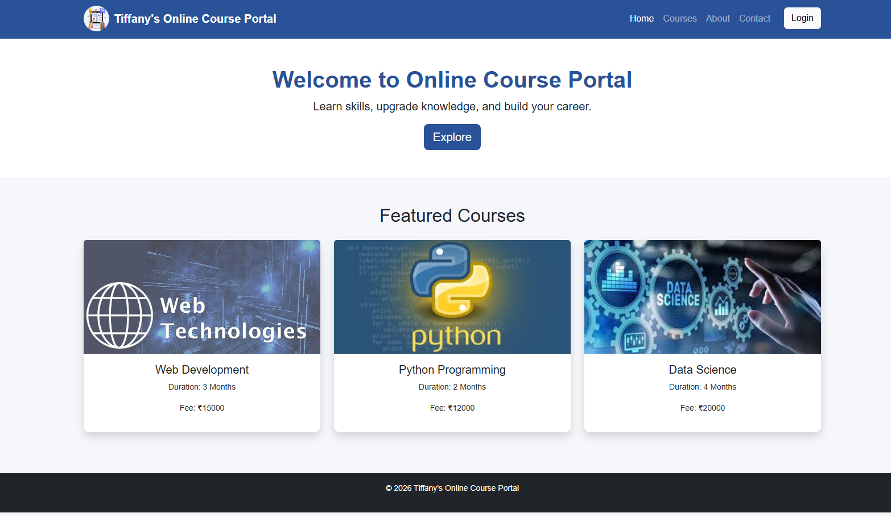
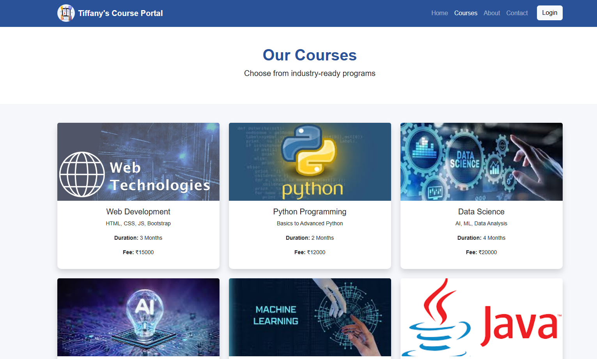
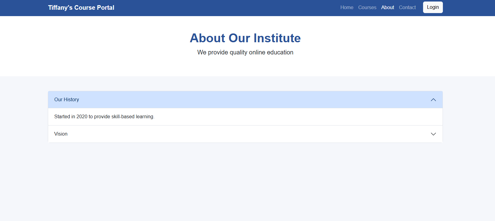
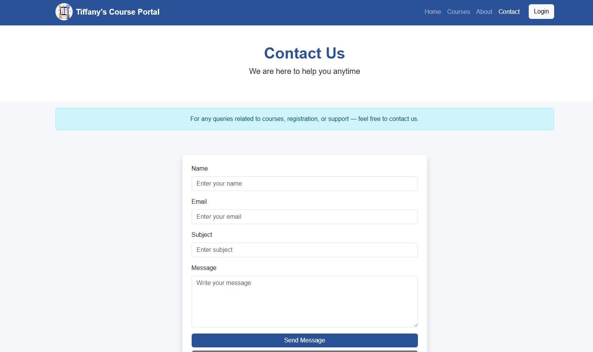
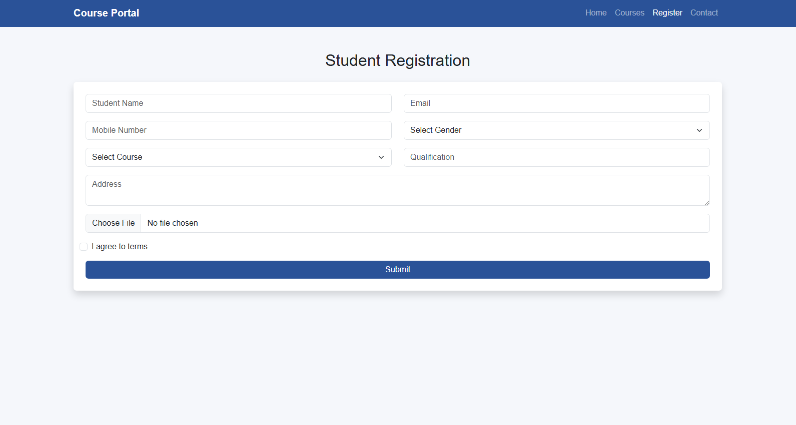
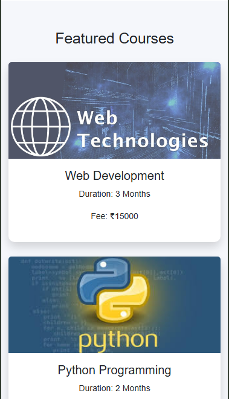
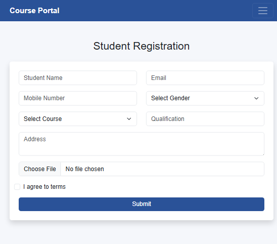

# 📘 Online Course Portal

## Project Overview

The Online Course Portal is a responsive web-based application developed using HTML5, CSS3, Bootstrap 5, and JavaScript. The portal allows users to browse courses, view details, register online, and contact the institute.

The website is fully responsive and works smoothly on mobile, tablet, and desktop devices.

---

## Technologies Used

* HTML5
* CSS3
* Bootstrap 5
* JavaScript

---

## Bootstrap Components Used

* Navbar
* Grid System
* Typography
* Buttons
* Cards
* Forms
* Input Groups
* Alerts
* Dropdown Menu
* Carousel
* Accordion

---

## Project Pages

### Home Page

* Responsive Navbar
* Hero Section
* Carousel Slider
* Featured Course Cards
* Footer Section

### Courses Page

* Course Listing Cards
* Course Details (Duration, Fee, Description)
* Responsive Grid Layout

### About Page

* Institute Information
* Vision and Mission Sections
* Trainer Cards
* Accordion Component

### Contact Page

* Contact Form
* Input Fields (Name, Email, Subject, Message)
* Alert Message on Submission
* Reset Button

### Registration Page

* Student Registration Form
* Course Selection Dropdown
* File Upload Option
* Checkbox for Terms and Conditions
* Success Message on Submit

---

## Responsive Design

### Mobile (<576px)

* Single column layout
* Collapsible navbar
* Full-width forms and cards

### Tablet (≥768px)

* Two-column layout for cards and forms

### Desktop (≥992px)

* Multi-column layout
* Full dashboard-style course display

---

## Project Structure

```text
online-course-portal/
│
├── index.html
├── courses.html
├── about.html
├── contact.html
├── registration.html
├── README.md
│
├── css/
│   └── style.css
│
├── images/
│   ├── logo.jpg
│   ├── web.jpg
│   ├── python.jpg
│   ├── data-science.jpg
│   ├── ai.jpg
│   ├── ml.jpg
│   ├── java.jpg
│   ├── cloud.jpg
│   ├── cyber.jpg
│   └── uiux.jpg
│
└── screenshots/
    ├── home.png
    ├── courses.png
    ├── about.png
    ├── contact.png
    └── registration.png
```

---

## Screenshots

### Home Page


### Courses Page


### About Page


### Contact Page


### Registration Page


### Mobile View


### Tablet View


---

---

## How to Run the Project

1. Download or clone the repository
2. Open project folder in VS Code
3. Open `index.html` in browser
4. Or use Live Server extension for best experience

---

## GitHub Repository

Repository Link:

[https://github.com/your-username/online-course-portal](https://github.com/your-username/online-course-portal)

---
## Author

**Kammalapally Navya**

Online Course Registration Portal
